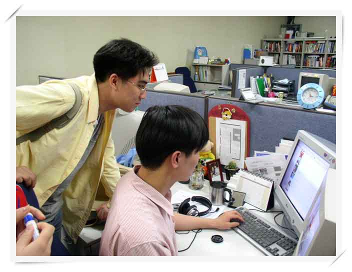

2004년 1월 산업기능요원으로 블루넷이라는 웹에이젼시에 편입되었습니다.

개발자로서 첫 사회생활이었는데, 거의 매일 볶음밥먹으며 야근했던 기억이 생상하네요

힘들었지만 이때 좋은 동료들과 만날 수 있었던게 제 인생에서의 큰 행운이었던거 같습니다.

동료들 덕분에 짧은 기간 내 빠른 성장을 할 수 있었던거 같습니다.

거의 20년 된 내용들이라 이제와서 경력이라고 쓰기도 민망하긴 하지만, 그래도 기억에 남는 점들이 있어 기록해보려 합니다.

# 프로젝트 목록

3년도 안되는 기간인데 정말 많은 프로젝트를 거쳤습니다.

거의 1~2달급으로 뺑뺑이 돌았네요.

대부분의 개발은 Java (JSP), Oracle 이었습니다. 

그리고 모델2 (MVC패턴) 가 아닌 모델1 개발이 대부분이었습니다.

여러가지 프로젝트 중 특별히 기억에 남던 내용만 간단히 적어봅니다.

----

### 중소기업청 수위탁거래 실태조사  (2006)
    
    단순 CRUD 가 아닌 복잡한 워크플로우.
    Spring, Struts, iBatis SqlMap, JSTL 1.1	를 도입하여 개발.
    스프링을 처음 적용해보며 삽질도 하였으나 무사히 완료.

### 환경부/행자부 홈페이지 유지보수	 (2006)	
    
    E-Nara 라는 행자부 정보 시스템 연동 부분.
    Base64 로 첨부파일 포함된 통 XML 파일 하나가 전송 됨.
    이를 디코딩해서 다시 파일로 풀어 제공하는 등이 기억남.

### 강남구청 문화체육 통합 사이트 (2005)
    
    Oracle 퍼포먼스 튜닝 업무. 
    자주 수행되는 SQL을 발견하여, 이 쿼리중 조인 수행하는 컬럼에 Index를 추가하는것만으로 한번에 해결.

### DB지식 정보 시스템 웹사이트 개선 2차 사업 (2005)		
    자체 개발한 공통 모듈을 통한 생산성 향상.
    예상 일정보다 빠르게 개발 완료했던 뿌듯했던 기억.

### 문화 컨텐츠 진흥원 블로그 개발 (2005)
    이거 보안이 막혀 업로드가 안되고 vim 으로 개발했던 힘든 기억

### 대한광업진흥공사 홈페이지 리뉴얼 (2005)
    사원공채 프로그램 중 적은 기간에 수많은 지원자가 엑세스를 하여 서버가 느려짐.
    static hashtable 로 인메모리 캐싱하는 방법을 적용.
    메인페이지의 엑세스수가 높을때도 성능 저하 없이 해결.

### 자원정보시스템(KOMIS) 개편용역사업 (2004)
    - 기존 Informix 로 구축되어있던 구 EDMS 시스템의 마이그레이션
    - 웹서버에서 우선순위 높은 데몬 쓰레드를 통해 회원 대량메일 발송.
    - 개발 중 root 에서 rm -rf * 해서 서버를 날려먹은 아픈 기억.
    AIX os 에서 루트로그인 하면 폴더 바뀌는지 몰랐음. 
    서버가 2대라서 다행히 넘어갔으나 수명이 확 줄은 듯.
    이를 계기로 항상 pwd 를 확인하는 습관이 생겼다.

### 국가인권위원회 홈페이지 재구축 (2004)
    방화벽이 막힌 여러대 서버 사이에 파일을 공유하기 위해, 
    공유되는 DB 의 BLOB 컬럼 안에 파일 넣고 공유하여 디코딩하는 개발이 기억남.

### 인천광역시서구청 서구 홈페이지 보강사업	(2004)

    2004년 당시 Struts 도입한 웹사이트 개발. 
    시대를 앞선 MVC 패턴 개발을 하였음. 

### 광진구청 정보포탈 홈페이지 개발 (2004)

    굉장히 실력없는 PM 이 와서 고생함.
    잘 보좌해서 PM의 오른팔이라는 소리까지 들으며 어떻게든 개발.

### 기타 

이하 프로젝트는 엑셀 업로드 DB입력 혹은 단순 게시판 CRUD 가 대부분이었음

- 국정홍보처 어린이 사이트 개발 (2006)
- 마포구청 업무관리 시스템 (2006)
- 대한체육회 홈페이지 재구축 (2005)
- 여성부 홈페이지 재구축 (2005)
- DB지식 정보 시스템 웹사이트 개선 사업	(2004)
- 서울시 산업경제 정보통신망 홈페이지 (2004)

# 커먼 모듈 제작

- IoC 패턴의 설정파일 중앙집중적 관리 핵심 모듈.
- Request , DB CRUD 작업등 각종 처리를 단순화시킨 유틸리티들.
- 정렬, 검색 게시판 형식 프로그램 고속 개발 컴퍼넌트 Canary.

SI프로젝트라 항상 반복되어 개발하는 부분이 있어서 짬짬히 모듈화.
소스버젼관리는 CVS로, Javadoc 생성과 jar 파일생성, 
그리고 기타 보조 문서의 생성과 업로드까지 일련의 루틴은 ANT 로 자동화.
병특 시절 가장 잘했던 일이었다고 생각.

# 추억샷

무슨 구청 홈페이지에 리소스 사진으로 쓴다고 컨셉샷 찍었었던거

----

죠낸 야근하고 사무실 문 잠그고 가던 거

----

