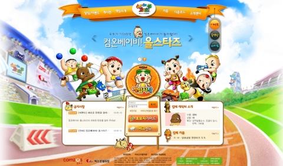

대학 졸업 후 반년간의 방황을 마치고 2009년 7월에 컴투스에 입사하게 되었습니다.

서비스기획운영팀이라는 게임개발 외 인프라/DB/웹개발/고객센터 등의 서포트를 전문으로 하는 조직이었습니다.

생각해보면 이 조직이 지금의 게임빌컴투스플랫폼의 전신이었던거 같네요.

약 2년간 근무하고 퇴사했었는데, 그때 SK 트윈타워에서 함께 근무하던 동료들을 몇년 뒤에 또 만나게 될줄은 이때는 몰랐습니다.

## 온라인게임 골프스타 홈페이지

온라인게임의 랜딩 홈페이지 개발입니다.

회원로그인, 런쳐 연동, 게시판 등등 여러가지 작업을 하였네요.

메인 개발 이후엔 다양한 이벤트 개발등등도 하였습니다.

### 기술 스택

- CentOS
- Java, JSP (model 1)
- PostgreSQL
- Spring, jquery

### 구현 내용

- Apache-Tomcat 서버세팅. 소프트웨어 로드밸런싱.
- 베너,팝업,이벤트 등 UI 개발
- 런쳐 연동 개발 
- 컴투스 포탈 SSO 모듈 개발
- 통합 설문조사 모듈 개발 
- 각 모듈 관리툴 개발
- 성능향상을 위한 DB 캐싱 모듈 개발
- 다중 서버 캐시 리프래시 모듈 개발
- 프레임워크 도입 JSP 모델1 개발 : Spring, jquery

----

## 온라인게임 컴온베이비 홈페이지

개발 내용은 위와 비슷한 회원연동, 런쳐 연동, 게시판, 이벤트 등입니다.

신입사원 워크샵 당일날 여기 홈페이지에 장애가 나는 바람에 워크샵 못가고 사무실로 돌아온 기억이 나네요.

### 기술 스택

- CentOS
- Java (model 2)
- PostgreSQL
- Spring, jquery

### 구현 내용

- Apache-Tomcat 서버세팅. 소프트웨어 로드밸런싱.
- 런쳐 연동 개발.
- 게시판 개발,
- 각 모듈 관리툴 개발
- 다중 서버 이미지 업로드 모듈 개발.
- 프레임워크 도입 JSP 모델2 개발 : Spring WEBMVC, iBatis, jquery, SiteMesh

----

