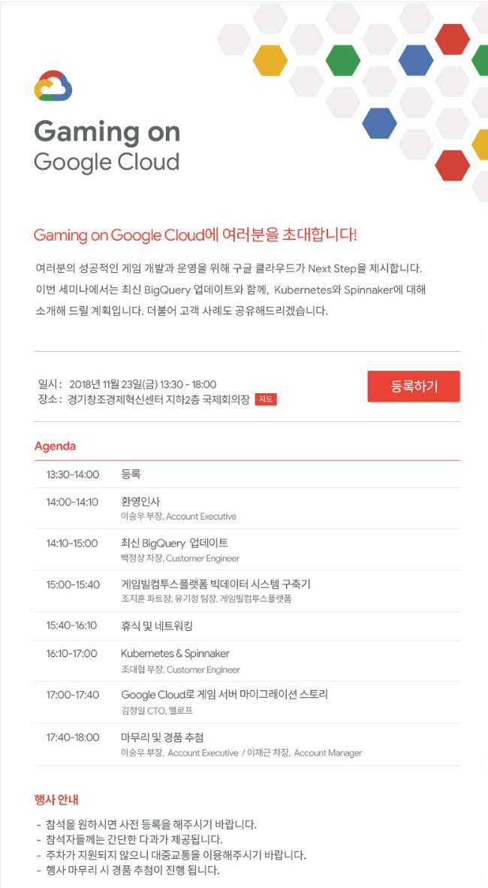

앞서 포스팅에서 소개했던 구글 클라우드 기반 ETL/DW 구축기에 대한 내용을, 판교에서 대외 발표하게 되었습니다.

이전 직장 (NHN) 건물 바로 옆에서 이런 발표를 하고 있으니 뭔가 감회가 새롭더군요.

발표 내용은 이전 포스팅때 올렸던 ETL 구축기 입니다.

https://tech.gamevilcom2us.com/blog/3922

----

----

