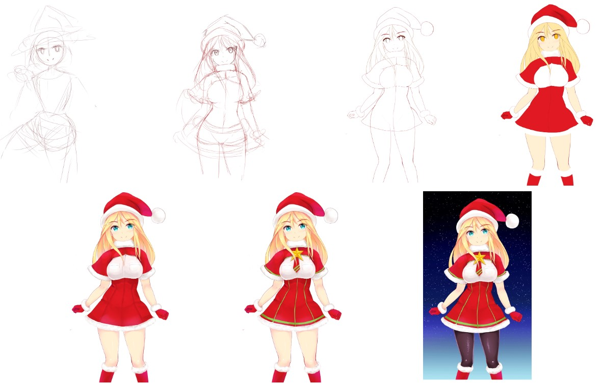
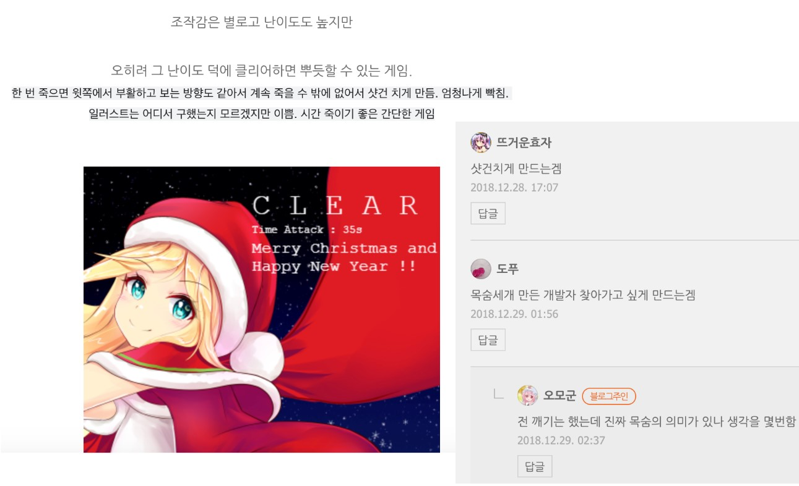

2018년 12월에 연차도 많이 남은김에 쉬면서 공부도 할 겸 사이드 프로젝트로 1인 게임 개발을 시도해보았습니다.

그 결과물은 이하 URL 에서 보실 수 있습니다.

https://game.nostia.com

----

# 게임 내용

스페이스바나 클릭을 누르면 발판을 딛고 점프합니다.

오래 누르고 있을수록 길게 점프합니다

계속 발판을 딛고 올라가서 맨 윗에 있는 선물보따리를 찾으면 엔딩입니다.

----

# 제작 과정 사내 공유

1인 게임 개발에 대한 여러가지 기술적 호기심에서 시작한 사이드 프로젝트인데,

그 과정에서 얻게 된 지식들이 많아서 그것을 정리해서 사내 발표로 공유했습니다. 

## Typescript 

Phaser3라는 Typescript 로 HTML5 게임을 만드는 프레임워크로 개발하였습니다.

최종 소스는 github 에도 올렸습니다.

https://github.com/jo8937/santajump
 

----

## 그래픽 작업 과정

그래픽 리소스를 직접 제작했습니다. 

우선은 준비물입니다. 

제작 과정은 다음과 같습니다.

1. 스케치
2. 선따기
3. 기본채색
4. 명암
5. 효과 

### 그래픽 리소스 작업 과정

게임에서 사용하는 그래픽은 클립스튜디오 위에 모두 수작업으로 그려서만들었습니다.

이렇게 해서 만든 리소스는 Texture Packer 등 무료툴을 통해 게임에 사용 가능하게 한장으로 묶습니다.

### 일러스트

게임에 사용되는 일러스트도 직접 그렸습니다.

이하에 그림 그리는 과정입니다.

----

## 사운드 리소스

사운드 리소스도 직접 모두 만들었습니다. 제작 과정은 다음과 같습니다.

우선 준비물입니다.

### 효과음

점프 시 "또잉~" 하는 사운드도 직접 편집했습니다.

- 점프 사운드 : 또잉~ 
  - 베이스 한마디 입력
  - Pitch 조정
  - 낮은음에서 높은음으로
  - 스테레오 아웃 필터
  - 각종 오디오 뭉개기 효과

### 배경 음악 작곡

배경음악은 Logic X Pro 를 사용하여 직접 작편곡하였습니다.

작업 순서는 다음과 같습니다.

1. 컨셉 정하기 : 만들고 싶은 느낌의 노래를 정해서 코드 카피 (징글벨)
2. 스마트 드럼 루프  : 시끄러움/조용함 ~ 단순함/복잡함 사이의 한 점. 찍어놓으면 알아서 드럼비트 생성해줌
3. 베이스 넣기 : 건반으로 입력. 미묘하게 안맞는건 Quantize로 정렬
4. 메인 멜로디 :  일단 건반으로 징글벨 멜로디 입력해봄. 입맛에 맞게 멜로디 변경
5. 조미료 사운드 : 템버린이나 특수효과 추가
6. 믹싱 :  악기별 사운드 출력 조정
7. 마스터링  :  필터 및 출력

----

## 랭킹서버

랭킹서버는 Go 언어로 개발하였습니다.

----

# 사이드 프로젝트를 통해 얻은 것

1인 게임 개발이 어떻게 가능할까 궁금했는데, 직접 시도해보고 그 과정을 모두 체득할 수 있었습니다.

또한 부가적으로 얻은 것들도 있습니다. 

- Typescript 에 대해 알게 됨
- 무엇이든 가능하다는 자신감

### 여담

간단한 게임이지만 인터넷에 올리니 누군가가 플레이하고 리뷰를 남겨주었습니다.

무언가 만드는 사람으로서 피드백을 받는 일이 매우 뿌듯한 일이라는 것을 세삼 알 수 있었습니다.

----

