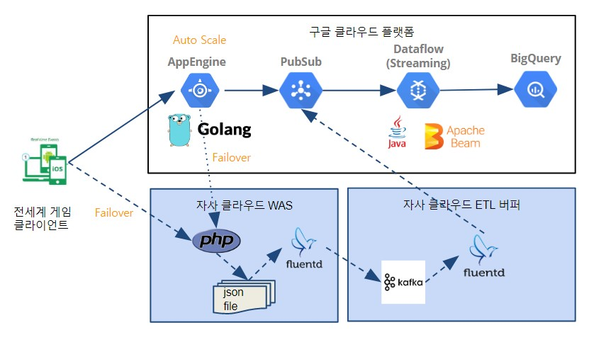

2020년 1월부로 팀장으로 발령받았습니다.

그리고 이 글을 쓰는 지금은 2021년 2월.

1년이 지난 지금 돌아보니 좀 아쉬운 점이 많네요. 

이 방향이 맞는지는 모르겠으나 여러가지 시도를 해보며 좌충우돌 열심히 운영하고 있습니다 ㅜㅜ 

---- 

## 데이터기술팀 소개

게임빌컴투스플랫폼 데이터기술팀에서는 ETL 파이프라인 관리, 모니터링 서비스 관리, 데이터 추출, 데이터 거버넌스, 머신러닝 서비스 구축, 데이터 분석 웹사이트 구축 등의 업무를 하고 있습니다.

지속적으로 서비스 개선과 신규 서비스 출시 프로젝트를 내부에서 진행중입니다.

----

## 성과

팀장이 된 이후, 직접 코딩을 하는일은 없으나 다른 방면으로 성과를 내고 있습니다. 

### 비용 개선

- 빅쿼리 예약 슬롯 등 적은 비용으로 더 높은 효과를 내는 부분을 지속적으로 찾아 적용하여 클라우드 비용 30% 감소

### 신규 서비스 설계 구축

- 게임 동접 수집 및 모니터링 시스템 
  - 패킷 최소화를 위한 바이너리 프로토콜 설계
  - 멀티 클라우드 활용을 통한 고가용성 설계
  - Golang + GAE를 통한 고성능 서버 초기 프레임 개발

### 각종 감사 대응

- 보안 감사, 회계 감사 등에 대한 대응책 수립과 실행

### 팀원 업무 효율화를 위한 서포트

- 기술 세미나 및 면담
- JIRA / Confluence / GSuite 내 업무기록 자동 취합기를 개발하여 성과 관리 효율화 

